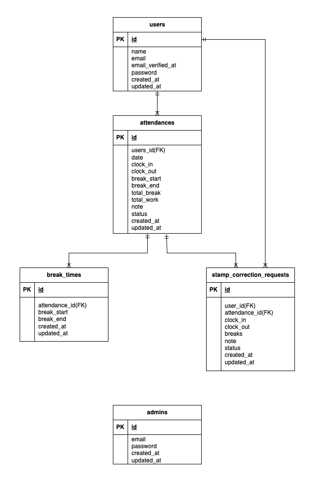

# 勤怠管理アプリ

## 環境構築

### Docker環境ビルド
1. git clone https://github.com/Mantis4590/attendance-app.git
2. docker-compose up -d --build

### Laravel環境構築
1. docker-compose exec php bash
2. composer install
3. .env.example ファイルから .env を作成し、環境変数を設定
4. php artisan key:generate
5. php artisan migrate
6. php artisan db:seed

## 使用技術（実行環境）
・PHP 8.x  
・Laravel 8.x  
・MySQL 8.0  
・Nginx 1.21  
・Docker / Docker Compose  
・MailHog（メール送信確認）

## ER図

## URL
・開発環境：http://localhost/  
・phpMyAdmin：http://localhost:8080/  
・一般ユーザー用会員登録画面：http://localhost/register  
・管理者用ログイン画面：http://localhost/admin/login

### 管理者ログイン情報
・メールアドレス：admin@example.com  
・パスワード：test1122